# MAP - SumoRobot

# Obsah

- Obsah
- Minisumo
- Informace o součáskách
- Tabulka použitých součástek
- Fotodokumentace
- Videoukázka
- Schéma zapojení
- Blokové schéma
- Závěr

# Minisumo

V ringu soutěží vždy jen dvojice robotů, kteří se položí za startovací čáry. Po startu se snaží vytlačit jeden druhého mimo ring. Pokud se jeden z robotů dotkne jakoukoli svou částí plochy mimo ring, prohrává. To platí i v případě, když z robota odpadne jakákoliv jeho část a ta následně bude vytlačena nebo sama se dotkne plochy mimo ring.

# Blokové schéma

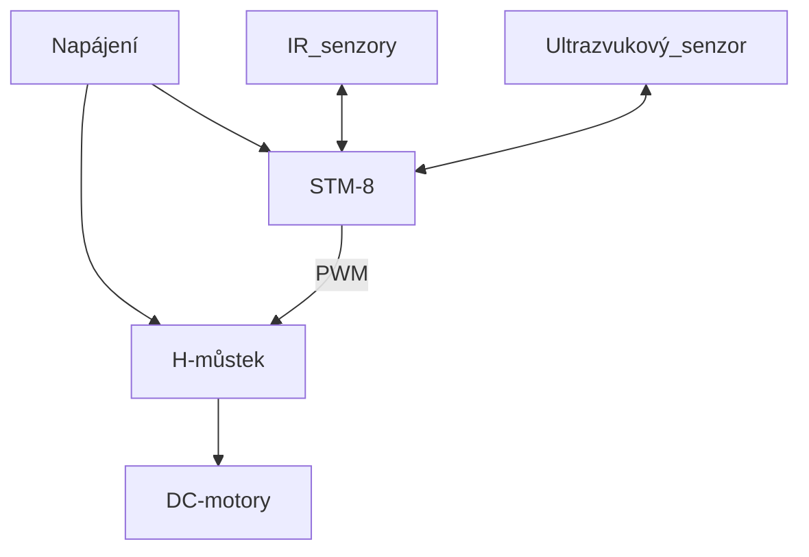
```mermaid
flowchart TD;
    Napájení --> STM-8;
    Napájení --> H-můstek;
    STM-8 -- PWM--> H-můstek;
    H-můstek --> DC-motory;
    IR_senzory <--> STM-8;
    Ultrazvukový_senzor <--> STM-8

```

# Vývojvý diagram

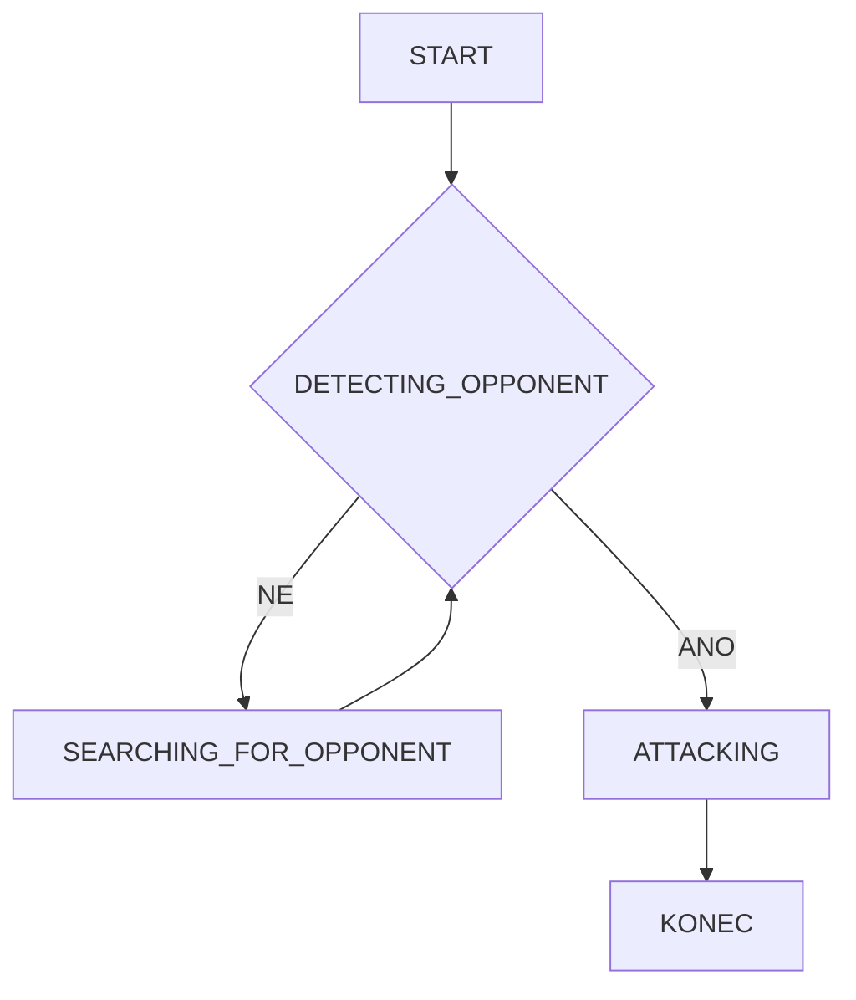
```mermaid
graph TD
START --> DO{DETECTING_OPPONENT}
DO --> |NE| SEARCHING_FOR_OPPONENT
SEARCHING_FOR_OPPONENT --> DO
DO --> |ANO| ATTACKING
ATTACKING --> KONEC
```

# Schéma zapojení
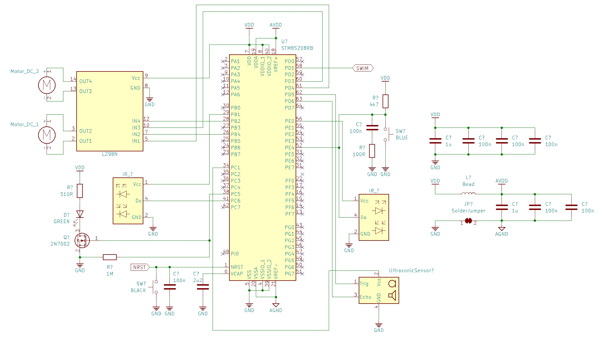

# Tabulka použitých součástek

V této tabulce nalezneme seznam použitých součástek.
| Název | Typ | počet| cena za kus | datasheet (webová stránka) |
| :--- | :----: |:----: | ---: | :----: |
|STM8 |NUCLEO-8S208RB | 1x |366 Kč|[STM8S208RB](https://www.st.com/resource/en/user_manual/um2364-stm8s208rbt6-nucleo64-board-stmicroelectronics.pdf) |
|IR Senzor |TCRT5000 |2x | 18 Kč|[Reflective Optical Sensor with Transistor Output](https://www.laskakit.cz/user/related_files/tcrt5000_datasheet.pdf)|
|Ulzvuk. senzor |HC-SR04 |1x | 38 Kč|[HC-SR04 User Guide](https://www.laskakit.cz/user/related_files/hc-sr04_ultrasonic_module_user_guidejohn.pdf) |
|Dc. motor |GA12-N20 |2x | 108 Kč|[G12-N20 Geared Mini DC Motor](https://www.handsontec.com/dataspecs/GA12-N20.pdf) |
|H-můstek |L298N |1x | 58 Kč|[DUAL FULL-BRIDGE DRIVER](https://www.laskakit.cz/user/related_files/l298n.pdf) |
|Držák baterií |BH-341-1A|1x | 34 Kč|[COMF BH-341-1A](https://www.laskakit.cz/comf-bh-341-1a-drzak-baterie-4xaa-dratove-vyvody/) |
|Kola |- |2x | 28 Kč|[Kolo gumové 43x19mm](https://www.laskakit.cz/kolo-gumene-43x19mm/) |
|Stavebnice Merkur |- |- | - |[MerkurToys.cz](https://eshop.merkurtoys.cz/k4-stavebnice) |
|Stahovací pásky |- |- | 90 Kč|[100-pack, Stahovací páska (2.5x200)](https://www.alza.cz/100-pack-stahovaci-paska-2-5x200-d1488352.htm) |
|Propojovací kabely|F/M, M/M, F/F|-|80 Kč|[Propojovacíkabely M/f](https://www.laskakit.cz/dupont-propojovaci-kabely-40ks-m-f-samec-samice--10cm-/?gclid=EAIaIQobChMIxPqH14Cv-AIVw4ODBx2sxAdBEAQYAyABEgIR2_D_BwE)|

# Informace o součástkách

## STM-8

STM8 Nucleo-64 je vývojová deska s STM8S208RB MCU. MikroKontroler je mozek celého robota. Napájení sdílí spoleně s H-můstkem.
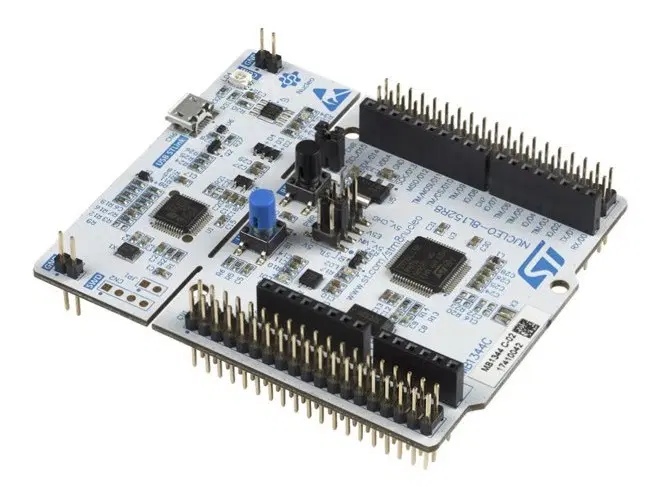

## Infračervený senzor

Robot disponuje 2 infračervenými senzory pro sledování čáry. Senzory kontrolují, zda se robot nachází v hracím poli a že z něj nevyjede.  
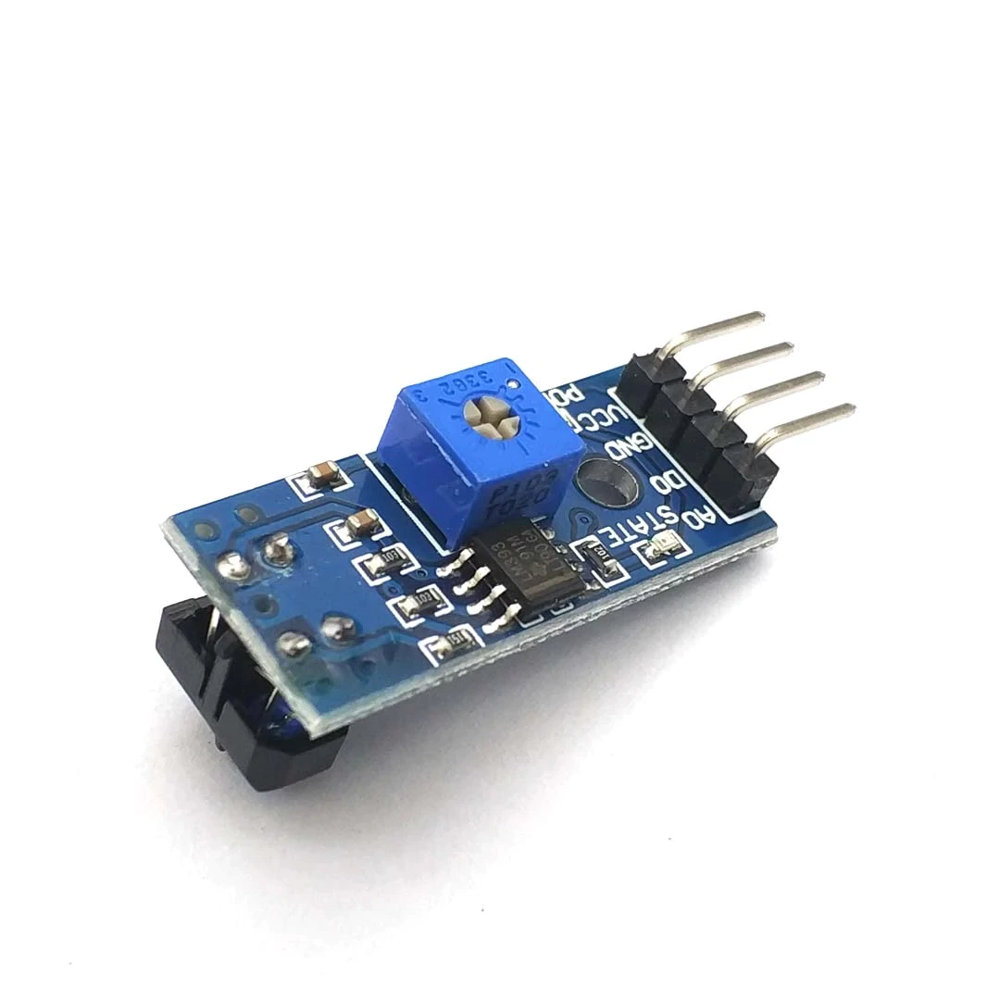

## Ultrazvukový senzor

V přední časti robota se nachází ultrazvukový senzor, jehož prací je určit přítomnost nepřítele. Nachází-li se nepřítel před robotem, robot se rozjede a plnou parou do protívníka narazí a vytlačí ho ven z hřiště.  

## DC Motor

Stejnosměrné motory s převodovkou jsou jedinným pohonem sumorobota. Nenechte se ale s nimi zmást, i přes jejich velikost dokáží předat dostatečně velkou sílu, aby poháněli robota a zároveň protivníka vytlačili ven z hřiště.  
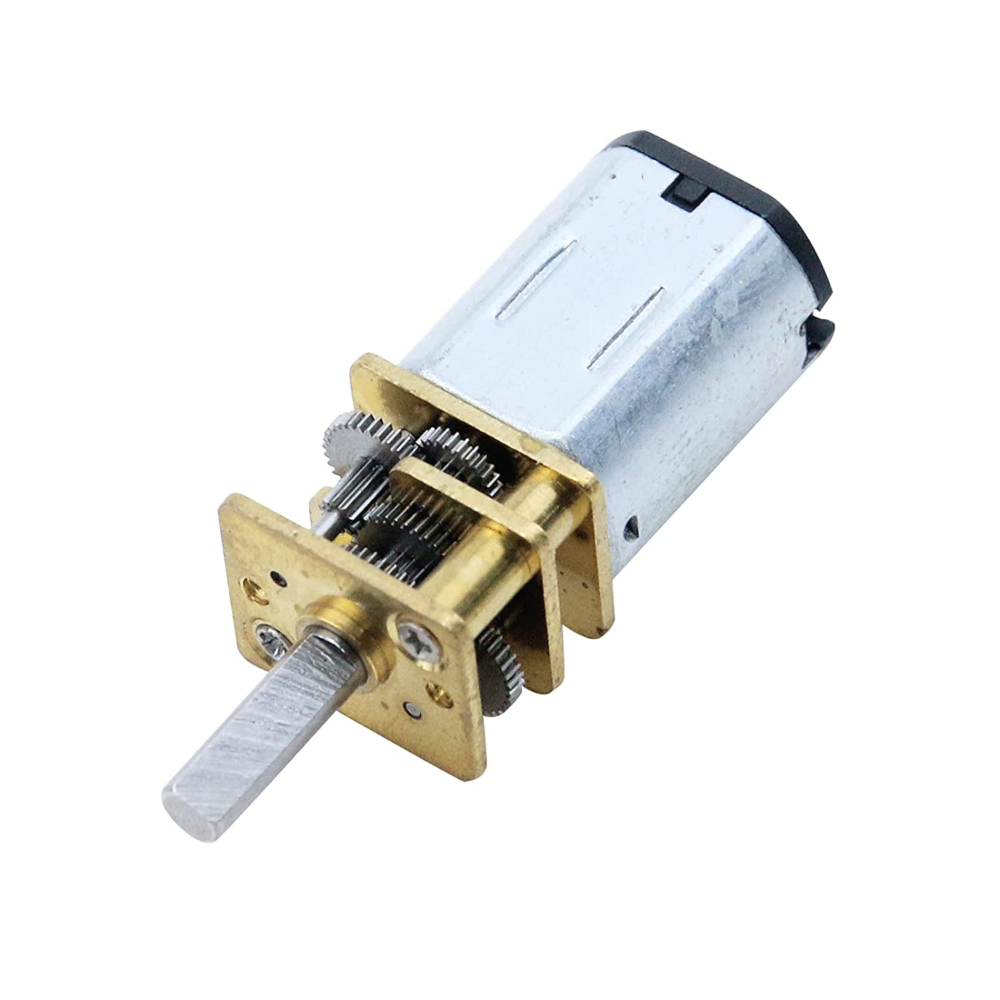

## H-můstek

Jedná se o ovládací prvek, který ovládá chod stejnosměrných motorů. Umožňuje motorům chod dopředu, dozadu, ale i každý jiným směrem. H-můstek je napájen 4 x 1.5V bateriemi.  
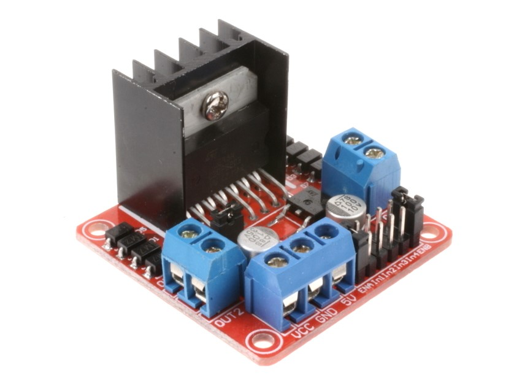

## Držák baterií

Nápájení obstarávají 4 AA baterie, které jsou usazeny do držáku baterií COMF BH-341-1A.  
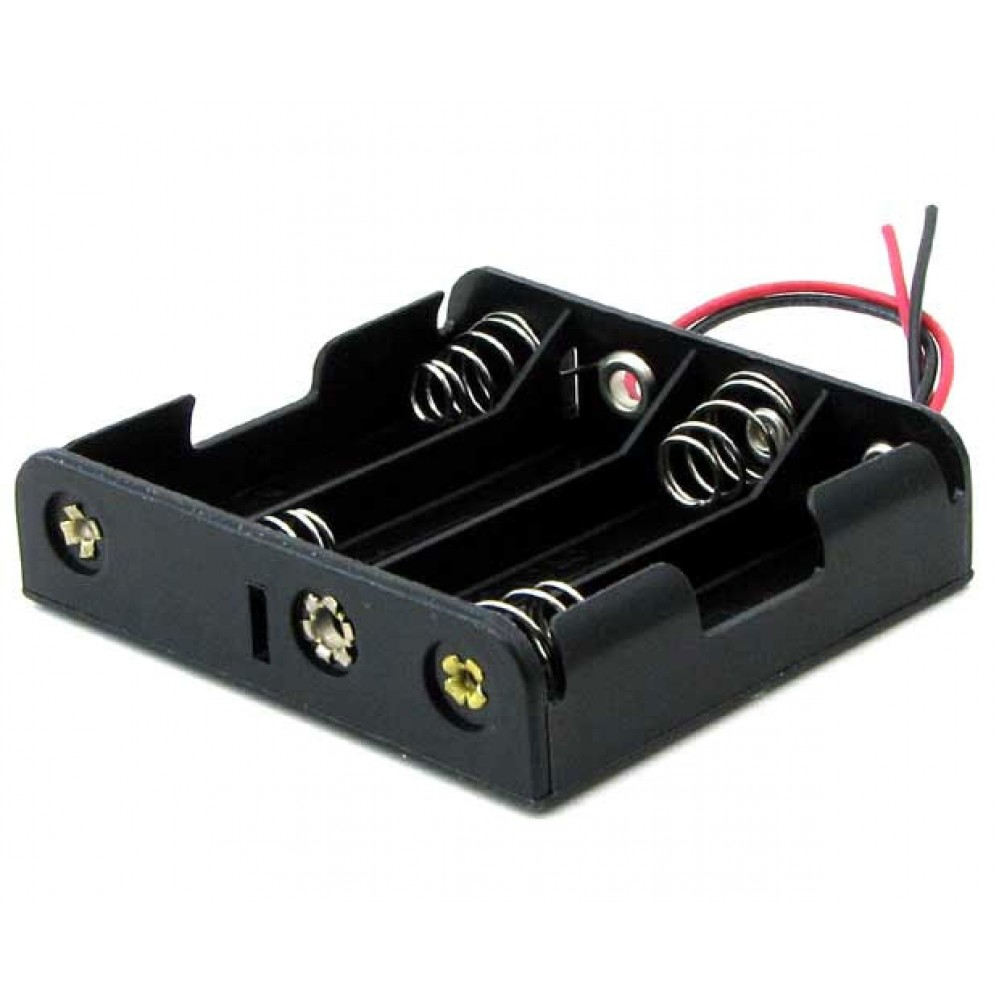

## Kola

Dc motory jsou osazeny koly s gumovou pneumatikou o rozměrech 43 x 19 mm. Kola byla navržena přímo pro hřídel motoru.  
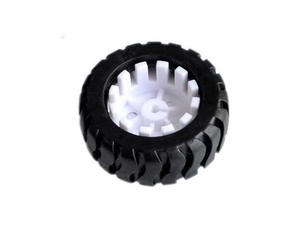

## Stavebnice Merkur

Tělo robota je kompletně sestaveno ze stavebnice Merkur, se kterou si určitě každý z nás alespoň jednou hrál.  
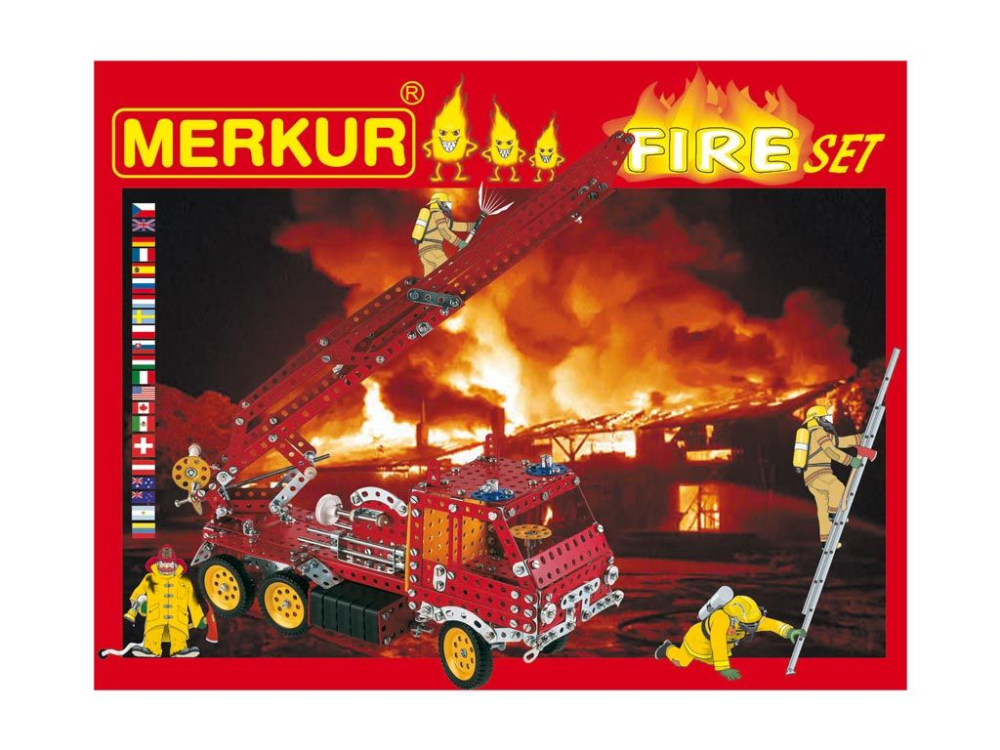

## Ostatní součástky

Dalšími použitými součástkami jsou propojovací kabely, které slouží k propojení jednotlivých částí robota, a stahovací pásky, které pomáhají držet určité součástky na místě.  
 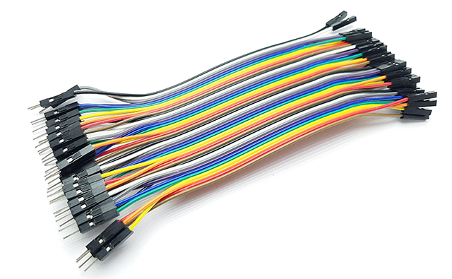

# Fotodokumentace

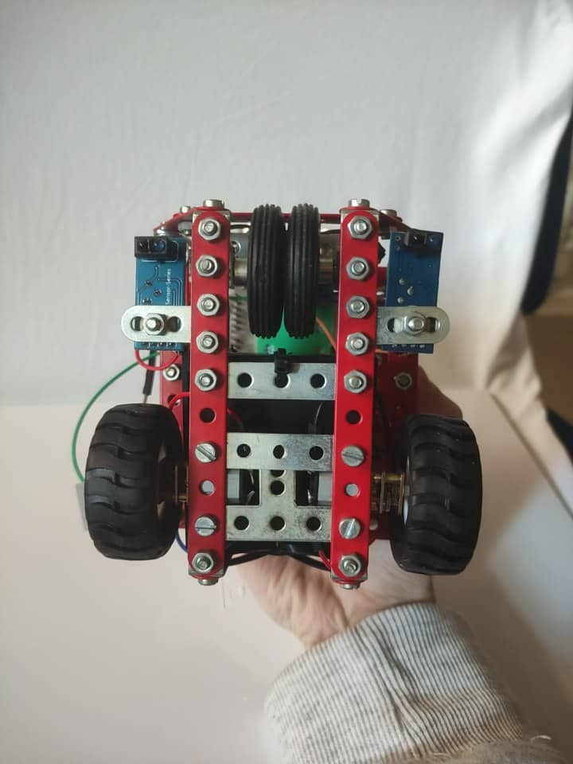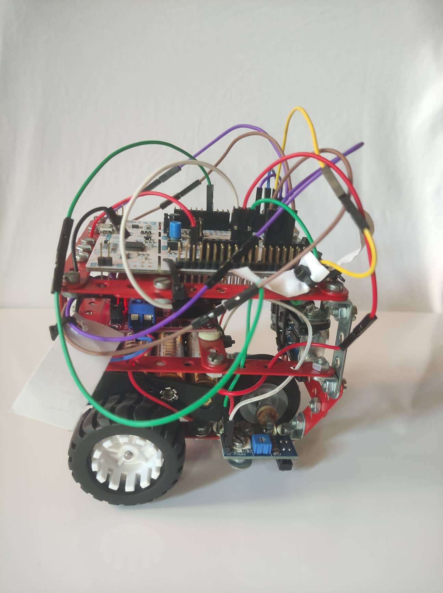
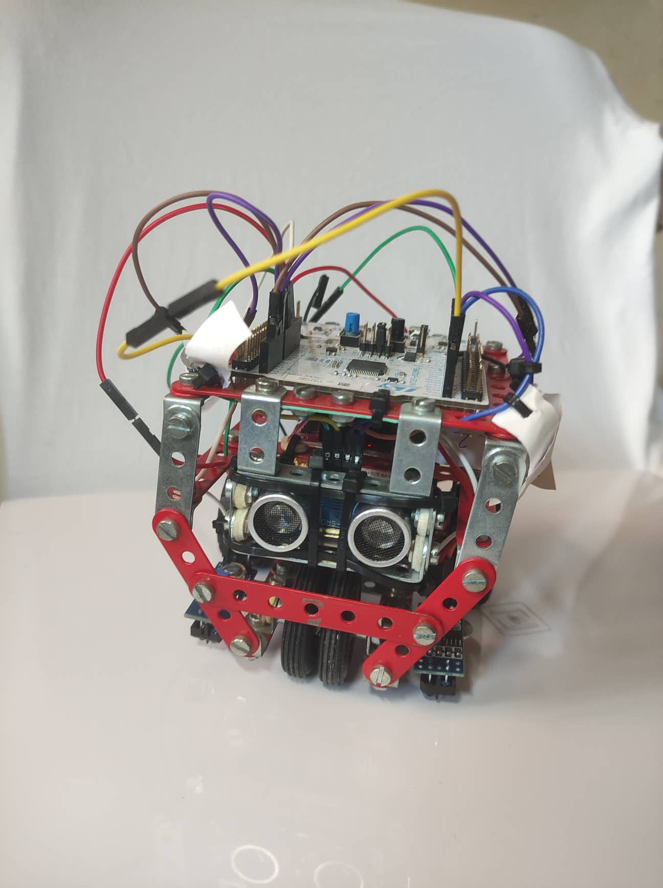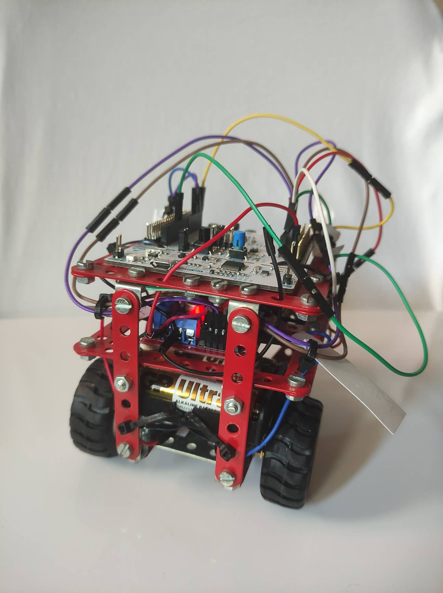
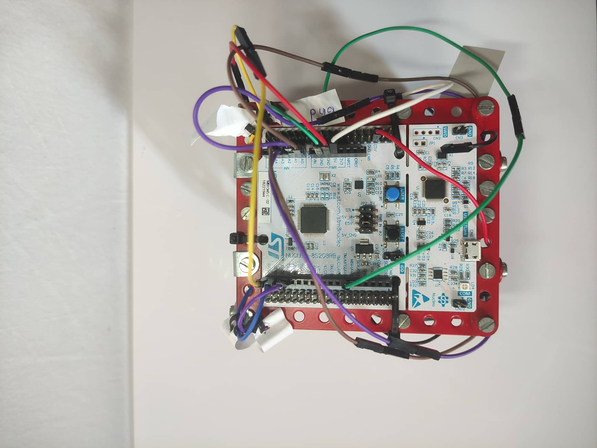

# Videoukázka

Zde naleznete krátká videa z testování při prvních zprovoznění [infračerveného senzoru](https://www.youtube.com/shorts/qDU-vjNzq4A) a [ultrazvukového senzoru](https://www.youtube.com/watch?v=CRXJ4Qp8BMs).

# Závěr

Při tvorbě projetku jsme si prošli jak pozitivními, tak i negativními zkušenostmi. Nadosmrti si budeme pamatovat první pohyby našeho výtvoru, ze kterého se postupem času stal funkční sumorobot. Bohužel jsme se neobešli bez problémů. Hned ze začátku programovací fáze se objevil problém, kdy jsme nebyli schopni vyřešit funkci ultrazvukového senzoru. Po několika dnech zkoušení se ukázalo, že problém není na naší straně a my byli nuceni senzor vyměnit, což nás o několik dní zdrželo. Každopádně jsme se naučili mnohé jak o součástkách, se kterými bychom se ve škole nesetkali, tak i programovacím jazyce C. Doufejme, že náš robot vyjde z arény jako vítěz.

# Rozdělení Práce

## Petr Cupal

- Návrh zapojení
- Zajištění součástek
- Zapojení robota
- Sestavení
- Dokumentace (schéma zapojení, blokové chchéma, seznam součástek)

## Martin Bernát

- Návrh programu
- Zapojení robota
- Tvorba programu
- Dokumentace (návrh vývojového diagramu, natočení videí, pořízení fotek, oprava pravopisných chyb)
